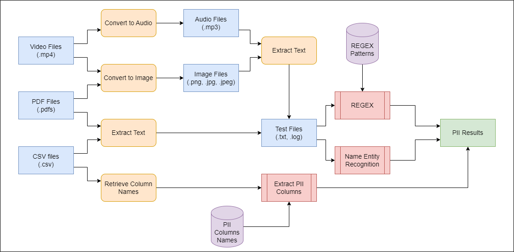

# Data Watchdog

## Table of Contents

- [Project](#data-watchdog)
  - [Table of Contents](#table-of-contents)
  - [About The Project](#about-the-project)
  - [Demo](#demo)
  - [Methodology](#methodology)
  - [Tech Stack](#tech-stack)
  - [File Structure](#file-structure)
  - [Getting started](#getting-started)
  - [Screenshots of Website](#screenshots-of-the-website)
  - [Contributors](#contributors)
  - [License](#license)

## About The Project

Data Watchdog is a tool built to find and classify Personally Identifiable Information (PII) like names, emails, Aadhaar numbers, and PAN numbers in different types of data storage. It works with databases like MySQL and cloud services like Google Cloud and Amazon S3. The tool supports various file types, including unstructured files (such as `.txt`, `.log`, `.jpg`, `.pdf`) and structured files (such as `.csv`). 

**Objective**: Storing personal data comes with risks, and businesses need to follow rules to protect it. Data Watchdog helps companies find and classify personal data in their systems, making sure they follow data privacy laws like GDPR and CCPA, and reduce the risk of data breaches.

**Features**: 

1. Data Ingestion: Handles data from multiple file types like text files, log files, images, CSVs, PDFs etc

2. PII Detection: Detects personal data using machine learning and other techniques.

3. Risk Assessment: Calculates a risk score based on the type of detected PII.

4. Data Visualization: Shows the analytics associated with detect PII.

## Demo

https://github.com/user-attachments/assets/597ad48b-8e24-47e1-8d08-26b8420f3aae

## Methodology

We primarily deal with 4 types of files, which are Text Files (`.txt`, `.log`), Image Files (`.png`, `.jpg`, `.jpeg`), PDF Files (`.pdf`) and CSV Files (`.csv`). Details about each PII extraction process can be found <a href="model/README.md">here</a>

### Flowchart



### Sequence Diagram


### API Diagram

## Tech Stack

- 

- 

- 

- 

- 

- 

## File Structure
```
👨‍💻Data Watchdog
 ┣ 📂assets
 ┃ ┣ 📂img          
 ┃ ┣ 📂temp                            // Sample files for testing
 ┃ ┣ 📂results                         // Output
 ┣ 📂client                            // Frontend        
 ┃ ┣ 📂static    
 ┃ ┣ 📂templates    
 ┃ ┃ ┣ 📄home.html
 ┃ ┃ ┣ 📄configure.html
 ┃ ┃ ┣ 📄dashboard.html                            
 ┣ 📂model                                      
 ┃ ┣ 📄detect.py                       // Core functionality
 ┃ ┣ 📄utils.py 
 ┃ ┣ 📄analytics.py
 ┃ ┣ 📄postprocess.py
 ┃ ┣ 📄main.py
 ┃ ┣ 📄requirements.txt
 ┃ ┣ 📄README.md            
 ┣ 📂server                            // Backend 
 ┃ ┣ 📂archive  
 ┃ ┣ 📄app.py  
 ┃ ┣ 📄requirements.txt      
 ┣ 📄README.md
``` 

## Getting Started

### Installation

Clone the project by typing the following command in your Terminal/CommandPrompt

```
git clone git@github.com:PritK99/Data-Watchdog.git
```
Navigate to the Data Watchdog folder

```
cd Data-Watchdog
```

#### Usage

Create a virtual environment to install all the dependencies

```
python -m venv data-watchdog
```

Activate the virtual environment

For Windows: ```data-watchdog\Scripts\activate```

For Linux: ```source data-watchdog/bin/activate```

Install all the required dependencies

Open a new terminal in root folder and navigate to the server folder

```
cd server/
```

Install all the required dependencies

```
pip install -r requirements.txt
```

> **Note** <br>
> <i>Path to `poppler` and `pytesseract` are required in `utils.py` to perform pdf to image conversion and OCR respectively.
>
> For `poppler` refer <a href="https://github.com/oschwartz10612/poppler-windows/releases/tag/v24.07.0-0">here</a>.
>
> For `pytesseract` refer <a href="https://tesseract-ocr.github.io/tessdoc/Installation.html">here</a>.
>
> Please replace the paths in `utils.py` with your paths.</i>

Once all the above steps are completed, run the createdatabase.py script using the following command in the terminal in `server` directory:

```
python app.py  
```

Running the server will load the frontend at `http://localhost:5000/`

> **Note** <br>
><i>The configuration page will require the configurations of SQL or Cloud that we want to analyze. For demo purpose we are using `PostgreSQL` using Render and `LocalStack` which allows us to simulate AWS cloud environment locally. For configuring these, steps are provided in <a href="Configure.md">Configure markdown file</a>.</i>

## Screenshots of the Website

### Home Page


### Configuration Page


### Analytics and Dashboard


### Output File


## Contributors

- [Kavan Gandhi](https://github.com/KGan31)
- [Prit Kanadiya](https://github.com/PritK99)

## License
[MIT License](https://opensource.org/licenses/MIT)
